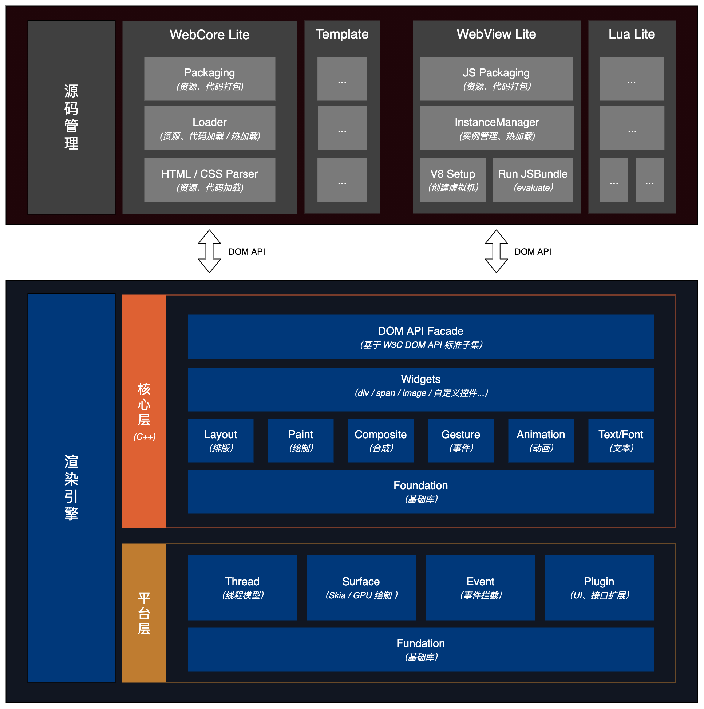

# 目标

* 跨平台：自绘控件，多个平台 UI 展示无差别
* 高性能：具备和 Native 一样的性能
* 标准化：基于 W3C 子集标准（HTML、CSS）
* 动态化：以「扩展」的形式兼顾动态化能力

参考阅读：[跨平台 UI 框架原理及展望](https://myz7656.github.io/2021/05/20/%E8%B7%A8%E5%B9%B3%E5%8F%B0%20UI%20%E6%A1%86%E6%9E%B6%E5%8E%9F%E7%90%86%E5%8F%8A%E5%B1%95%E6%9C%9B/)

# 标准化

以「W3C 子集」为渲染标准，大前端框架适配成本更低，同时获得相比 WebView 更好的性能体验。

* [CSS 子集规范](./w3c/css.md)
* [DOM 子集规范](./w3c/dom.md)
* [HTML 子集规范](./w3c/html.md)