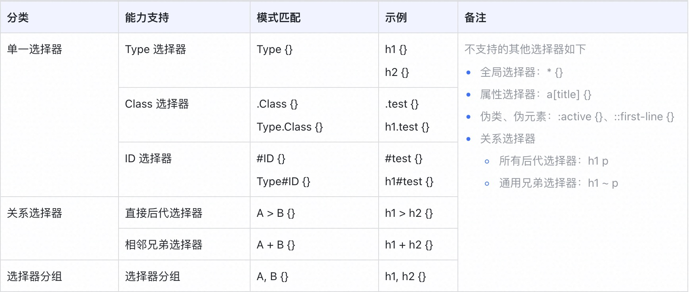
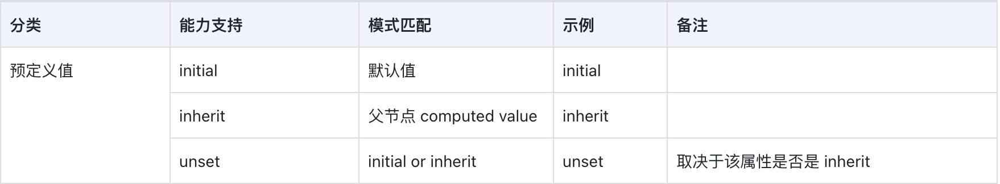
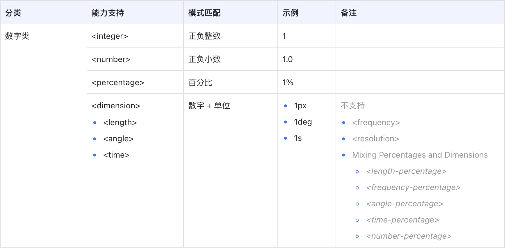
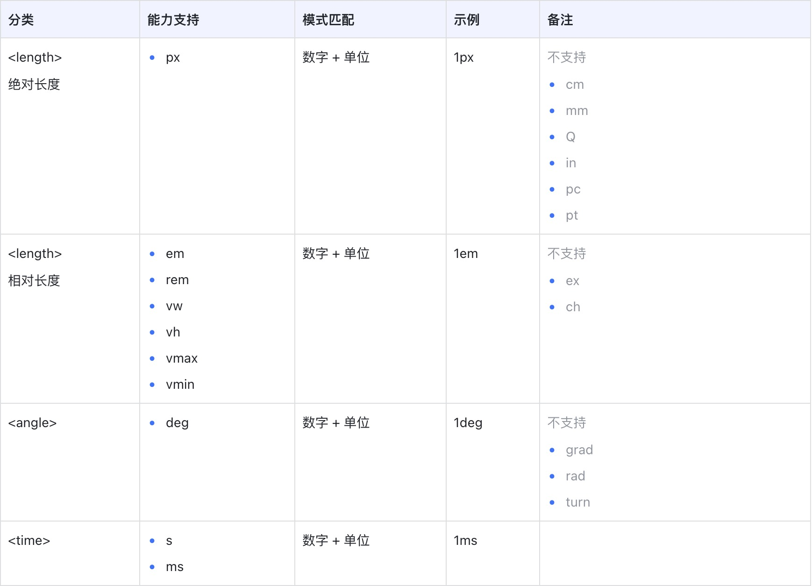

# 1.背景

W3C CSS 标准在发展过程中有两个主要问题。第一，带着历史包袱走。很多新的设计理念已经可以取代旧的设计，但是浏览器始终要兼容旧的标准，所以变得非常臃肿；第二，标准制定者和实现者不是同一波人，设计者天马行空，不用考虑实现者的难度，有些设计不够接地气。这些问题都导致浏览器的实现会存在较大的性能问题，且代码逻辑复杂，难以维护和优化。

# 2.目标
实现一个 CSS 子集标准，对 W3C CSS 标准去肥增瘦。该标准是业界常用的 CSS 功能集合

* 重点目标：可以满足「绝大多数」业务场景开发
* 辅助目标：易用性，在不影响性能的情况下进一步增加 CSS 子集适配

<b>策略</b>：从满足绝大多数业务场景上看，实现 React Native 支持的样式基本可以达到目标。在易用性方面看主要是考虑前端人员使用习惯，尽量支持更多的写法等。

主要参考对象：解决「重点目标」

* React Native 的样式支持（尽量做到 100%）
* W3C 标准文档协议以及各浏览器支持度：[W3C 标准](https://www.w3.org/TR)

# 3.子集定义

子集定义包括两个方面

* 语法子集
* 关键字子集

## 3.1 语法子集
语法通用标准：[CSS3 标准语法](https://www.w3.org/TR/2019/CR-css-syntax-3-20190716/)

词法解析方面全面遵循 CSS 语法规则，做到能对 CSS 文件完整解析。在语法方面主要包括

* 选择器
* 值和单位
* 层叠与继承

这三个部分则选取性支持。

### 3.1.1 选择器

* 完整定义：[CSS 选择器](https://www.w3.org/TR/2018/REC-selectors-3-20181106/)
* 中文学习文档：[CSS 选择器](https://developer.mozilla.org/zh-CN/docs/Learn/CSS/Building_blocks/Selectors)

这里选择器定义只选取性能较高的部分去实现，即元素 CSS 变动之后影响范围最小的。

### 3.1.2 值和单位

* 完整定义：[值和单位](https://www.w3.org/TR/2019/CR-css-values-3-20190606/)
* 中文学习文档：[值和单位](https://developer.mozilla.org/zh-CN/docs/Learn/CSS/Building_blocks/Values_and_units)

<b>预定义值</b>

<b>数字类</b>

<b>尺寸</b>

<b>字符串</b>

### 3.1.3 层叠与继承
* 完整定义：[层叠与继承](https://www.w3.org/TR/2021/REC-css-cascade-3-20210211/)
* 中文学习文档：[层叠与继承](https://developer.mozilla.org/zh-CN/docs/Learn/CSS/Building_blocks/Cascade_and_inheritance)